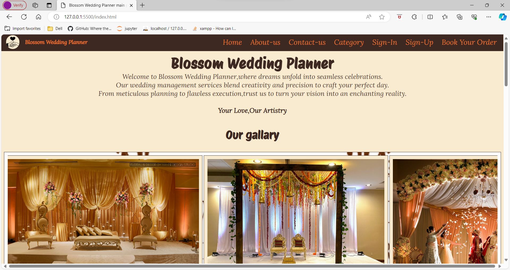
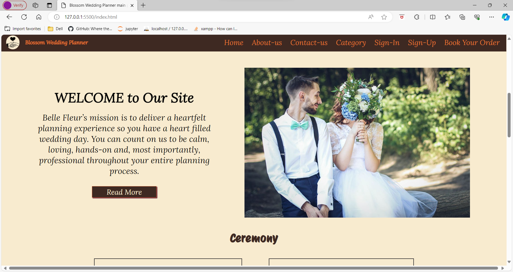
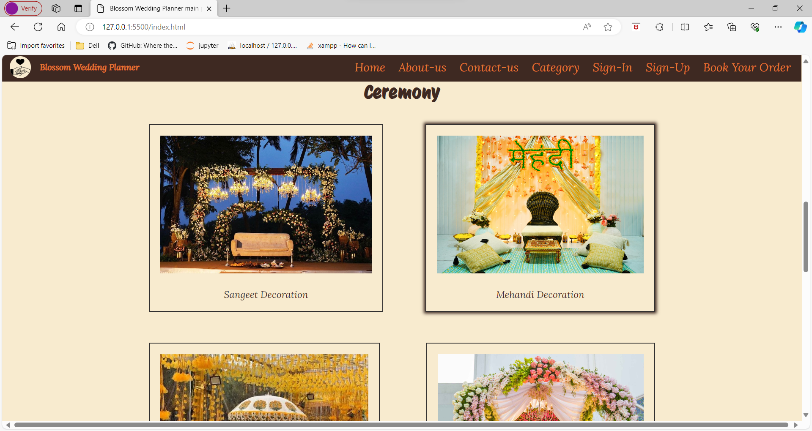
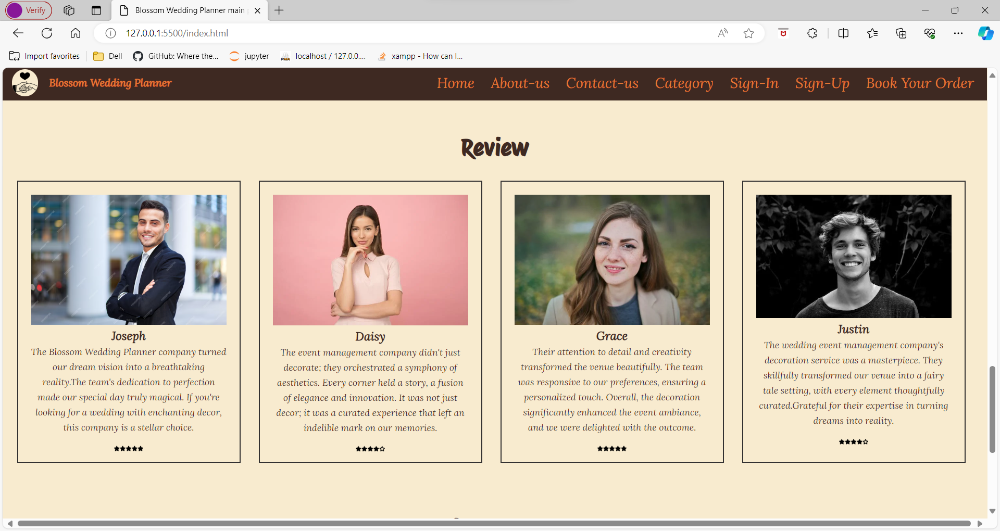

# Project-Name: blossom_wedding_planner_project1_icp7.0

---
# Project-Title: Blossom Wedding Planner 💞✨

---
Welcome to G-18 Html & CSS First Project . **Blossom Wedding Planner** ,where dreams unfold into seamless celebrations.Our wedding management services blend creativity and precision to craft your perfect day. From meticulous planning to flawless execution,trust us to turn your vision into an enchanting reality.

This Project is simply made by using HTML & CSS. Weather you are Beginner Student to coding or Web Development this repository will be your go to resource for HTML and CSS.
---
## Features
1. Expert in Plannig & Designing
2. Quality assurance
3. Exclusive offers
4. Affordable Pricing
5. Descent Organizing
---
### Home Page

---

---

---

---

---

## How to Contribute 🪴💻

We welcome contributions from the community to help us expand and improve this handbook if you would like to contribute follow the steps:

1. Fork the repository to your GitHub account.
2. Make your changes ,add new content or fix the existing issues.
3. Open pull request in this repository.

---
## Contributors

Made with [contrib.rocks](https://contrib.rocks).
  

